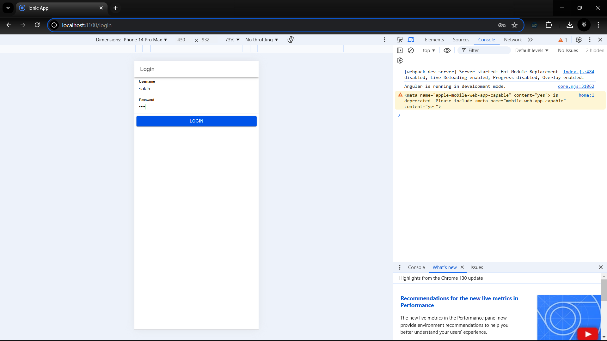
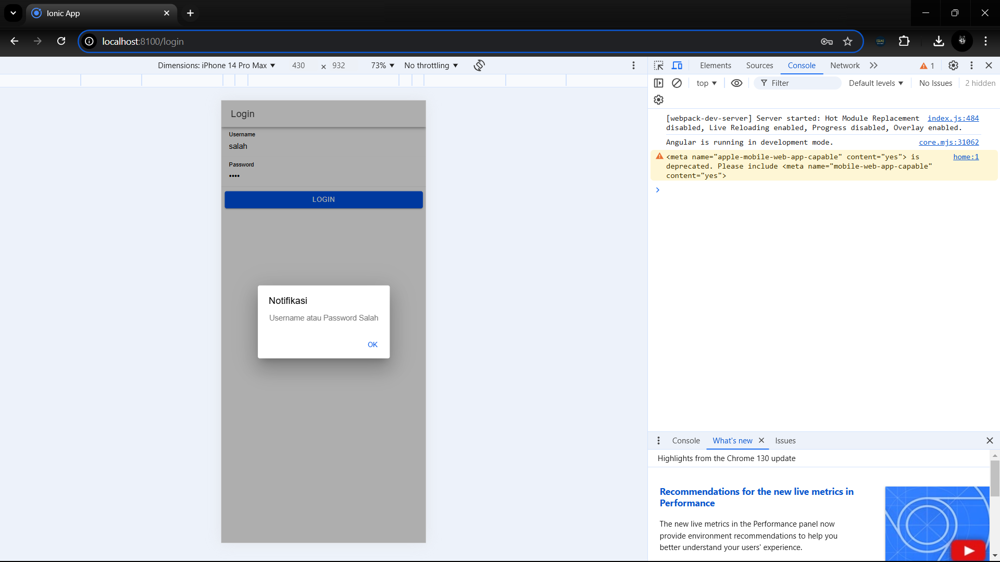
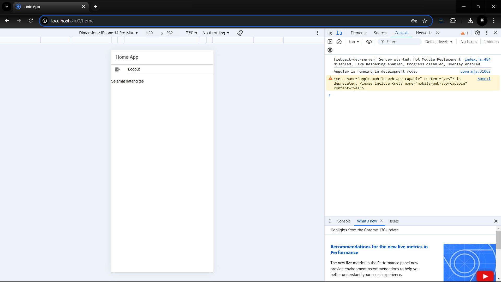

Nama : Ghaza Indra Pratama
NIM : H1D022073

# proses login
1. Sebelum masuk ke aplikasi, pengguna harus melakukan login terlebih dahulu.
2. Pengguna memasukkan username dan password pada form login yang telah disediakan.
3. Sistem akan melakukan verifikasi dengan memeriksa database untuk memastikan bahwa username dan password yang dimasukkan sesuai.
4. Keamanan password dalam database sudah dijaga dengan enkripsi menggunakan metode MD5.
5. Jika username dan password benar, pengguna berhasil masuk ke dalam aplikasi.
6. Jika username atau password salah, pengguna tidak dapat masuk dan harus mengulangi proses login.

# Proses Login PHP
1. File koneksi.php:
- File ini diperlukan untuk menghubungkan aplikasi dengan database MySQL.
- Mengatur pengaturan CORS (Cross-Origin Resource Sharing), sehingga API bisa diakses dari aplikasi Ionic.

2. File login.php:
- Bertugas memproses data login dari pengguna.
- Menerima username dan password yang dikirim dari aplikasi Ionic.
- Password yang diterima diubah ke format MD5 agar sesuai dengan yang ada di database.
- Melakukan pengecekan ke database menggunakan query SELECT untuk memastikan data pengguna valid.

3. Proses Verifikasi:
- Jika data pengguna ditemukan, sistem akan:
  - Membuat token dengan kombinasi waktu dan password.
  - Mengirimkan response berisi username, token, dan status login berhasil.
- Jika data tidak ditemukan, sistem akan mengirimkan response bahwa status login gagal.

# Alur Login di Ionic
1. Service (authentication.service.ts):
- File authentication.service.ts berfungsi mengatur proses login ke API PHP.
- Memiliki fungsi untuk menyimpan token dan username di penyimpanan lokal menggunakan Preferences.
- Mengatur status login pengguna serta menangani berbagai pesan error yang mungkin terjadi selama proses login.

2. Guard:
- Terdapat dua file utama untuk menjaga keamanan akses:
  - auth.guard.ts:
    - Berperan sebagai pengaman yang selalu memeriksa apakah pengguna sudah login atau belum.
    - Jika pengguna belum login, mereka akan diarahkan ke halaman login. Jika sudah login, mereka dapat mengakses halaman home.
  - auto-login.guard.ts:
    - Memeriksa status login saat aplikasi pertama kali dibuka.
    - Jika pengguna sudah pernah login sebelumnya, akan langsung diarahkan ke halaman home; jika belum, tetap berada di halaman login.

3. Halaman Login (login.page.ts):
- Pada halaman login, proses dimulai saat pengguna menekan tombol login.
- Sistem akan memeriksa apakah username dan password telah diisi. Jika tidak, akan muncul pesan error.
- Jika data sudah lengkap, informasi dikirim ke API PHP.
- Setelah mendapat respons dari API:
  - Jika login berhasil, token dan username disimpan, form login dikosongkan, dan pengguna diarahkan ke halaman home.
  - Jika login gagal, akan muncul pesan "Username atau Password Salah".
  - Jika terjadi masalah koneksi, seperti server tidak aktif, akan muncul pesan "Login Gagal, Periksa Koneksi Internet".

4. Halaman Home (home.page.ts):
- Menampilkan nama pengguna yang sedang login.
- Memiliki tombol logout untuk keluar dari aplikasi.
- Saat tombol logout ditekan, sistem akan:
  - Menghapus token dan username dari penyimpanan.
  - Mengubah status login menjadi false.
  - Mengarahkan pengguna kembali ke halaman login.

# Keamanan
- Keamanan Password:
  - Password yang disimpan di database telah dienkripsi menggunakan MD5 untuk menjaga keamanan data.

- Validasi Pengguna dengan Token:
  - Sistem menggunakan token sebagai metode validasi untuk memastikan bahwa pengguna yang mengakses aplikasi adalah pengguna yang sah.

- Proteksi Route dengan Guard:
  - Semua routes dilindungi menggunakan Guard yang memastikan bahwa hanya pengguna yang telah login yang dapat mengakses halaman-halaman tertentu.

- Perlindungan API dengan CORS:
  - CORS (Cross-Origin Resource Sharing) diaktifkan untuk melindungi API, sehingga hanya aplikasi yang diizinkan yang bisa mengakses data melalui API.

- Validasi Input pada Form Login:
  - Form login memiliki validasi input. Jika pengguna mencoba login dengan mengosongkan salah satu atau kedua field (username atau password), sistem akan menampilkan pesan error "Username atau Password Tidak Boleh Kosong".

# screenshot
## salah

## Benar

